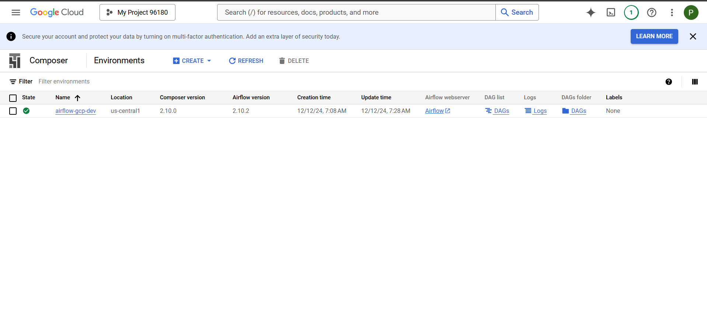

# Process Scheduling With Composer (Airflow)

## About
O projeto consiste em orquestrar uma movimentação de arquivos entre dois buckets no GCS, através do Composer (Airflow gerenciado pela Google Cloud Platform).

# Criação do recurso no GCP

# Cria Bucket no GCP

# Criado dois Bucket 

um de origem e outro de destino

# DAG criada no GCP

# Objetivo mover dados bucket origem para destino

Bucket origem

Bucket destino

# Após o processamento do Airflow

